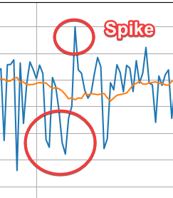
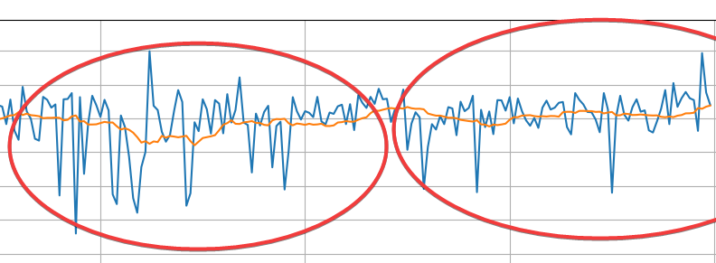
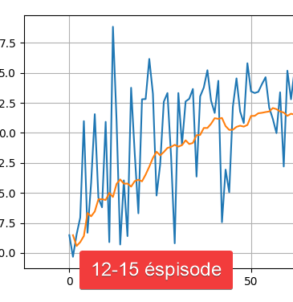
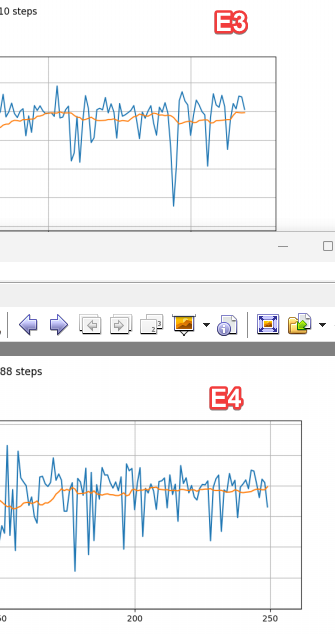

# Rapport Projet RL - Agent Rolling Ball

Auteur: Ajax DESHAYES--HUET
---

## Introduction

### Contexte
Ce projet porte sur l'entrainement d'un agent de Reinforcement Learning dans un environnement Unity (ML-Agents), avec un controle discret des actions pour deplacer une balle vers une cible (cube).

L'agent est entraine avec un algorithme Deep Q-Network (DQN), implante en Python, qui interagit avec Unity via un wrapper Gym en Python.

### Objectifs
- Concevoir et completer un agent DQN fonctionnel.
- Etudier l'impact des hyperparametres et des recompenses sur l'apprentissage.
- Comparer 4 experiences avec des configurations differentes.
- Interpreter les resultats (performance, stabilite, limites).
- Faire evoluer les objectifs au fil des experiences a partir des resultats observes.

---

## Methodologie

### Logique generale du rapport
Le rapport doit montrer une demarche iterative et non une suite de tests isoles.
Chaque experience sert a:
1. observer un comportement,
2. l'interpreter,
3. identifier une limite,
4. ajuster les parametres,
5. verifier si la nouvelle hypothese ameliore la situation.

Autrement dit, les resultats d'une experience modifient l'objectif de la suivante.

### Parametres modifiables et hypotheses
- **Gamma ($\gamma$)**: poids des rewards futures.
- **N (nombre d'episodes)**: duree d'entrainement (risque sous-apprentissage si trop faible).
- **Learning rate (lr)**: vitesse de mise a jour des poids.
- **Epsilon (exploration/exploitation)**: comportement aleatoire vs politique apprise.
- **F (frequence de mise a jour target network)**.
- **B (batch size)**: taille d'echantillon replay pour chaque update.
- **M (buffer memory)**: capacite de replay memory.
- **NN (taille reseau)**: capacite de representation, cout de calcul, risque d'instabilite.
- **Recompenses**: signal d'apprentissage (recompense intermediaire + recompense terminale).

## Experiences

> Consigne: lancer **4 experiences** avec des parametres differents.

### Fil conducteur experimental
Le rapport peut etre raconte comme une suite d'iterations:
- Experience 1: base initiale apres completion des exercices.
- Experience 2: ajustement pour reduire le lag et accelerer l'experience.
- Experience 3: correction d'un sous-apprentissage ou d'une instabilite observee.
- Experience 4: affinement final, validation de la configuration retenue et reduction des spikes encore trop presents.

### Tableau recapitulatif des experiences

| Experience | Gamma | N episodes | lr | Epsilon (debut/fin/decroissance) | F | B | M | NN | Recompenses | Attente principale |
|---|---:|---:|---:|---|---:|---:|---:|---|---|---|
| E1 (baseline) | 0.99 | 250 | 1e-4 | 0.9 / 0.05 / 2000 | 500 | 256 | 100000 | [9,512,512,5] | recompense intermediaire +/-0.02, terminale +1/-1, limite de temps -0.5 | Baseline stable a lancer |
| E2 | 0.99 | 150 | 7e-5 | 0.9 / 0.05 / 1500 | 500 | 128 | 100000 | [9,512,512,5] | recompense intermediaire +/-0.01, terminale +1/-1, limite de temps -0.7, limite de pas 400 | Reduire le temps de run et les spikes tout en limitant le circling (tourner autour de la recompense) |
| E3 | 0.99 | 220 | 1e-4 | 0.9 / 0.02 / 2000 | 300 | 128 | 100000 | [9,512,512,5] | recompense intermediaire +/-0.01, terminale +1/-1, limite de temps -0.5, limite de pas 500 | Recuperer stabilite et taux de succes sans changer l'architecture |
| E4 (finale) | 0.99 | 250 | 7e-5 | 0.9 / 0.02 / 2000 | 300 | 128 | 100000 | [9,512,512,5] | recompense intermediaire +/-0.01, terminale +1/-1, limite de temps -0.5, limite de pas 500 | Valider le meilleur compromis et lisser les spikes |

### Detail de chaque experience (a dupliquer)

#### Experience E1 - Baseline de reference

- **Choix des parametres**:
  - Configuration actuelle du projet (baseline): `gamma=0.99`, `N=250`, `lr=1e-4`, `epsilon=0.9/0.05/2000`, `F=500`, `batch_size=256`, `memory=100000`, reseau `[9,512,512,5]`.
  - Schema de recompenses: recompense intermediaire `+0.02/-0.02`, recompense terminale `+1/-1`, penalite de limite de temps `-0.5`.
- **Methodologie / reflexion / approche**:
  - Cette experience sert de point de reference pour comparer toutes les experiences suivantes.
- **Attentes avant execution**:
  - Verifier la stabilite globale de la courbe reward et la tendance de duree moyenne des episodes.
- **Resultats observes**:

<!-- ILLUSTRATION_E1_OBSERVATION: inserer ici une capture d'un passage avec variance forte (spikes) et une capture de fin de run plus stable. -->
  - Le run est complet: `episodes_completed=250`, `total_steps=47564`, `run_total_seconds=1247.941`.
  - Les moyennes globales sont positives: `mean_episode_reward=1.778`, `mean_episode_duration=190.256`.
  - En fin de run, la courbe montre une stabilisation relative autour d'une tendance positive.
  
  - En execution locale (Unity Editor), des ralentissements ont ete observes sur la machine pendant certains passages de l'entrainement.
  - La courbe reward monte progressivement en debut d'entrainement, puis se stabilise avec une moyenne lissee positive et des pics residuels.
  - La duree des episodes baisse globalement, mais reste tres variable avec des pics tout au long du run.
  - Des ecarts brusques apparaissent entre episodes consecutifs (ex. episodes 12-15), ce qui est compatible avec l'alea du spawn de la cible et l'exploration epsilon-greedy. 
  
  - Attention d'interpretation: le label du graphe indique "Last reward", mais la serie tracee correspond en pratique a la reward cumulee par episode.
- **Interpretation rapide**:
  - E1 valide la base DQN: l'agent apprend a atteindre la cible plus regulierement en fin de run.
  - Les spikes ne signifient pas un bug en soi; ils sont attendus dans un environnement stochastique avec exploration.
  - Le risque principal est que l'agent fasse du circling (tourne autour de la recompense sans atteindre la cible) pour accumuler des recompenses intermediaires sans succes terminal suffisamment fiable, ce qui motive une reduction de la recompense intermediaire et une limite de temps plus penalisee en E2.

#### Experience E2 - Compromis vitesse/stabilite
- **Choix des parametres**:
  - Hyperparametres Python: `gamma=0.99`, `N=150`, `lr=7e-5`, `epsilon=0.9/0.05/1500`, `F=500`, `batch_size=128`, `memory=100000`, reseau `[9,512,512,5]`.
  - Schema de recompenses Unity: recompense intermediaire `+0.01/-0.01` (au lieu de `+/-0.02`), recompense terminale `+1/-1` conservee, penalite de limite de temps `-0.7` (au lieu de `-0.5`) et limite d'episode `400` pas (au lieu de `500`).
  - Motivation principale: pendant E1, la simulation Unity a montre des ralentissements (lag), donc E2 privilegie un compromis vitesse/stabilite avant de pousser la performance brute.
- **Methodologie / reflexion / approche**:
  - E2 cible trois objectifs operationnels: reduire le temps de simulation, attenuer les oscillations, et limiter le circling (tourner autour de la recompense sans atteindre la cible).
  - Les changements sont volontairement moderes pour rester comparables a E1 et isoler les effets principaux.
  - Justification des changements lies au lag:
    - `N=150` reduit directement la duree totale du run et accelere le cycle test-analyse.
    - `batch_size=128` diminue le cout de chaque mise a jour DQN (moins de calcul par backward pass), ce qui aide a limiter la charge CPU/GPU pendant l'entrainement dans l'Editor Unity.
    - `max steps=400` evite des episodes tres longs peu informatifs, ce qui reduit aussi le temps de simulation.
- **Attentes avant execution**:
  - Diminution du temps total de run grace a `N` plus faible, `batch_size` plus petit et episodes plus courts.
  - Courbe reward potentiellement un peu moins explosive (moins de points de recompense intermediaire par pas + `lr` plus faible).
  - Baisse des episodes longs sans succes terminal, grace a une limite de temps plus stricte et plus penalisee.
  - Verification attendue du lag: baisse de `run_total_seconds` et de `mean_episode_elapsed_seconds` par rapport a E1.
- **Resultats observes**:

<!-- ILLUSTRATION_E2_OBSERVATION: inserer ici une capture d'episode timeout/errance et une capture de courbe restant proche de 0. -->
  - La courbe reward montre une stabilisation faible autour de 0.
  - Run complet: `episodes_completed=150`, `total_steps=41502`, `run_total_seconds=842.105`.
  - Moyennes globales: `mean_episode_reward=0.384`, `mean_episode_duration=276.68`, `mean_episode_elapsed_seconds=5.574`.
  - Les spikes restent importants sur la reward et sur la duree; la stabilisation est moins nette que prevu.
  - Beaucoup d'episodes se terminent au timeout (temps écoulé) (`terminal_reward=-0.7`): 59/150 (39.33%).
  - Le succes existe mais reste partiel (`terminal_reward=1.0`): 63/150 (42.00%).
  - Observation pratique post-run: une partie du lag percu venait du contexte d'execution (focus de la fenetre terminal), pas uniquement des hyperparametres.
- **Interpretation rapide**:
  - E2 a bien reduit le temps total de run par rapport a E1, mais au prix d'une baisse de qualite d'apprentissage (reward moyenne plus faible, episodes plus longs, nombreux timeouts).
  - La combinaison `eps_decay=1500` + `limite de pas=400` + `limite de temps=-0.7` parait trop contraignante pour converger proprement.
  - Le lag reste contraignant en pratique, donc E3 conserve un compromis `batch_size=128` et corrige d'abord les autres facteurs (limite de temps, epsilon final, nombre d'episodes).

#### Experience E3 - Stabilisation apres E2
- **Choix des parametres**:
  - Hyperparametres Python: `gamma=0.99`, `N=220`, `lr=1e-4`, `epsilon=0.9/0.02/2000`, `F=300`, `batch_size=128`, `memory=100000`, reseau `[9,512,512,5]`.
  - Schema de recompenses Unity: recompense intermediaire `+0.01/-0.01` conservee, recompense terminale `+1/-1` conservee, penalite de limite de temps `-0.5` et limite d'episode `500` pas.
- **Methodologie / reflexion / approche**:
  - E3 corrige E2 avec une strategie conservative: ne pas toucher l'architecture du reseau, conserver `eps_decay=2000` et retenir un compromis de calcul avec `B=128` pour eviter les ralentissements severes observes a `B=256`.
  - Le parametre `F` est abaisse de `500` a `300` pour synchroniser plus frequemment le target network, afin de reduire certaines oscillations observees en E2 sans introduire une rupture majeure de configuration.
  - `N` passe a `220` pour donner plus de temps d'apprentissage que E2 (150 episodes) sans revenir au cout complet de E1 (250 episodes).
  - `eps_end` passe de `0.05` a `0.02` pour reduire l'aleatoire en fin d'entrainement et stabiliser la politique finale.
  - Le but est d'isoler l'effet des contraintes trop strictes d'E2 (limite de temps courte et penalite forte) qui ont probablement augmente les echecs a 400 pas.
- **Attentes avant execution**:
  - Augmentation du taux de succes et baisse du taux de timeout.
  - Courbe reward plus lisible (moins de saturation autour des episodes coupes a 400).
  - Duree de run raisonnable (N=220) tout en laissant plus de temps d'apprentissage que E2.
- **Resultats observes**:

<!-- ILLUSTRATION_E3_OBSERVATION: inserer ici une capture d'approche de la cible avec contact rate encore inconsistent et volatilite residuelle. -->
  - Le run est complet: `episodes_completed=220`, `total_steps=54110`, `run_total_seconds=1481.531`.
  - Moyennes globales: `mean_episode_reward=0.5226`, `mean_episode_duration=245.95`, `mean_episode_elapsed_seconds=6.696`.
  - Repartition des terminaisons:
    - succes (`terminal_reward=1.0`): 123/220 (55.9%).
    - timeout (`terminal_reward=-0.5`): 37/220 (16.8%).
    - echec (`terminal_reward=-1.0`): 60/220 (27.3%).
  - La courbe reward progresse globalement mais reste volatile, avec des spikes encore visibles.
- **Interpretation rapide**:
  - E3 corrige une partie des effets negatifs observes en E2.
  - Le taux de succes remonte nettement (55.9% vs 42.0% en E2) et les timeouts baissent fortement (16.8% vs 39.33% en E2).
  - E3 reste toutefois en dessous de E1 sur la performance globale (reward moyenne et regularite de convergence).
  - Le compromis E3 est valide pour stabiliser sans exploser le cout de calcul, mais ne depasse pas encore la baseline E1.

#### Experience E4 - Finale (validation du compromis)
- **Choix des parametres**:
  - Configuration finale de validation: `gamma=0.99`, `N=250`, `lr=7e-5`, `epsilon=0.9/0.02/2000`, `F=300`, `batch_size=128`, `memory=100000`, reseau `[9,512,512,5]`.
  - Schema de recompenses Unity: recompense intermediaire `+0.01/-0.01`, recompense terminale `+1/-1`, penalite de limite de temps `-0.5`, limite d'episode `500` pas.
- **Methodologie / reflexion / approche**:
  - Cette experience sert de validation finale de la meilleure configuration candidate, avec un apprentissage un peu plus prudent pour lisser les spikes encore trop presents.
- **Attentes avant execution**:
  - Verifier si une baisse du learning rate et un temps d'apprentissage plus long reduisent les oscillations sans detruire le taux de succes.
- **Resultats observes**:

<!-- ILLUSTRATION_E4_OBSERVATION: inserer ici une capture comparant un passage turbulent debut run vs un passage plus regulier en fin de run. -->
  - Le run final est complet: `episodes_completed=250`, `total_steps=63588`, `run_total_seconds=1396.504`.
  - Moyennes globales: `mean_episode_reward=0.9013`, `mean_episode_duration=254.352`, `mean_episode_elapsed_seconds=5.5687`.
  - Repartition des terminaisons:
    - succes (`terminal_reward=1.0`): 152/250 (60.8%).
    - timeout (`terminal_reward=-0.5`): 39/250 (15.6%).
    - echec (`terminal_reward=-1.0`): 59/250 (23.6%).
  - La courbe reward reste variable, mais la fin de run est plus lisible que E3 avec moins de spikes marquants.
  
- **Interpretation rapide**:
  - E4 ameliore nettement E3 sur la reward moyenne et le taux de succes, tout en conservant un taux de timeout bas.
  - Le compromis vise (stabilite sans effondrement des performances) est globalement atteint.
  - E4 ne depasse pas E1 en performance brute, mais offre un equilibre plus prudent et plus robuste que E2/E3.

---

## Resultats

Cette section sert de synthese globale. Les details d'observation et d'interpretation sont documentes dans chaque experience.

### Resultats attendus vs observes (synthese)
- E2 atteint l'objectif de reduction du temps de run, mais degrade la qualite d'apprentissage (reward, succes, timeouts).
- E3 recupere une partie de la stabilite perdue en E2, sans retrouver le niveau global de E1.
- E4 ameliore encore le compromis (reward et succes en hausse vs E3), avec une fin de run plus lisible.
- Le couple limite de temps stricte + penalite forte en E2 parait trop contraignant, et le runtime reste sensible aux conditions machine.

### Tableau de comparaison finale

| Critere | E1 | E2 | E3 | E4 |
|---|---:|---:|---:|---:|
| Reward moyenne (fin de run) | 1.778 | 0.384 | 0.523 | 0.901 |
| Duree moyenne episode | 190.256 | 276.68 | 245.95 | 254.352 |
| Stabilite (spikes) | Moyenne | Faible (spikes frequents) | Moyenne-faible (amelioration vs E2) | Moyenne (moins de spikes en fin de run vs E3) |
| Taux de succes (si mesure) | 72.4% | 42.0% | 55.9% | 60.8% |

---

## Analyse

Les resultats confirment un compromis net entre vitesse de simulation et stabilite d'apprentissage: E2 accelere le run mais degrade la convergence, alors que E3 puis E4 retablissent progressivement la stabilite sans revenir aux couts les plus eleves. La recompense intermediaire reduite aide a limiter le circling, mais ne suffit pas seule si les contraintes de temps sont trop severes. Enfin, l'interpretation reste limitee par un nombre restreint de runs, l'alea du spawn, et la sensibilite au contexte d'execution (Editor/charge machine).

---

## Conclusion

- E1 reste la meilleure performance brute observee.
- E4 est la configuration recommandee pour le meilleur compromis stabilite/performance sur ce projet.
- Les objectifs initiaux sont atteints: agent fonctionnel, impact des hyperparametres observe, comparaison des 4 experiences complete.
- Pour consolider ces conclusions: repeter les runs avec seed fixee, puis tester Double DQN si necessaire.

---

