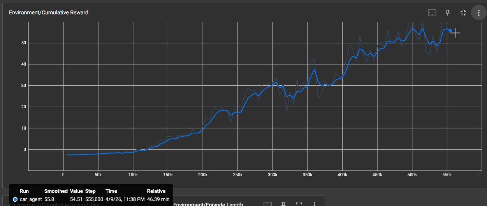
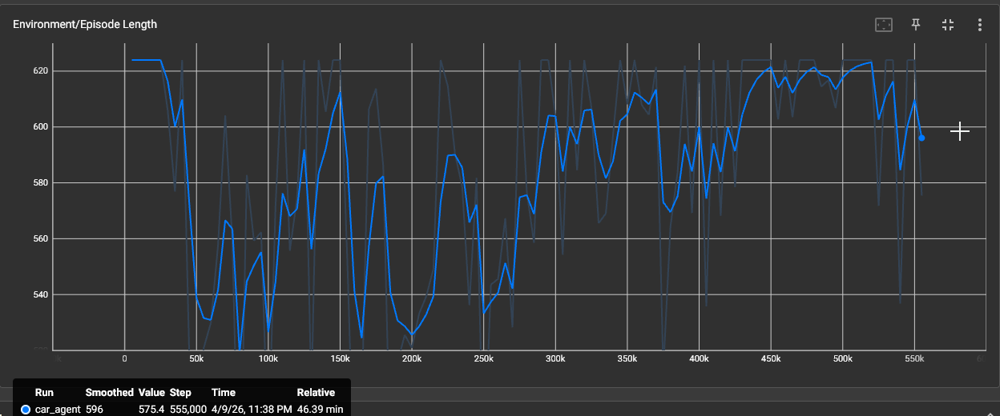
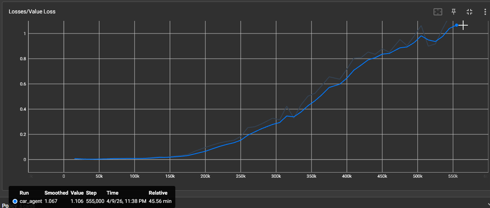
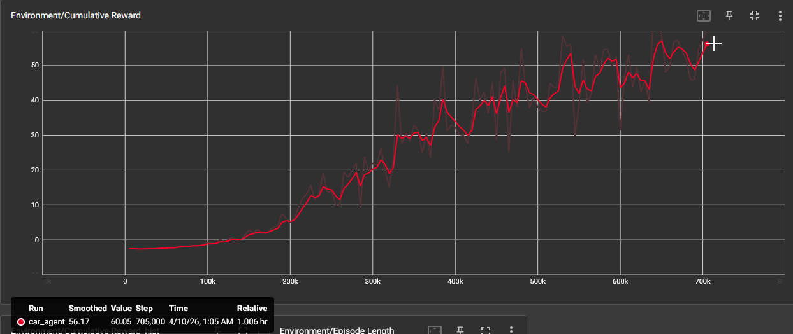
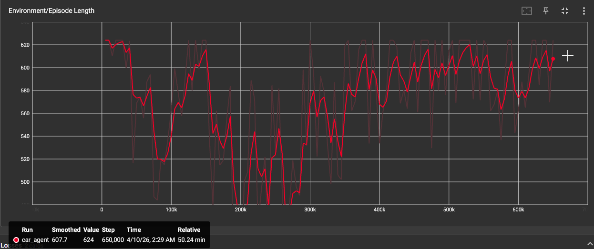
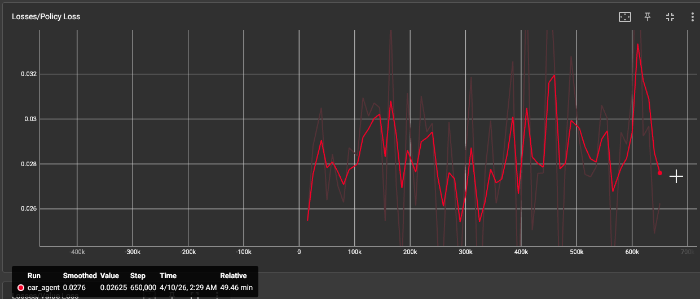
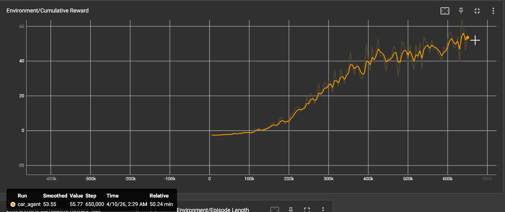
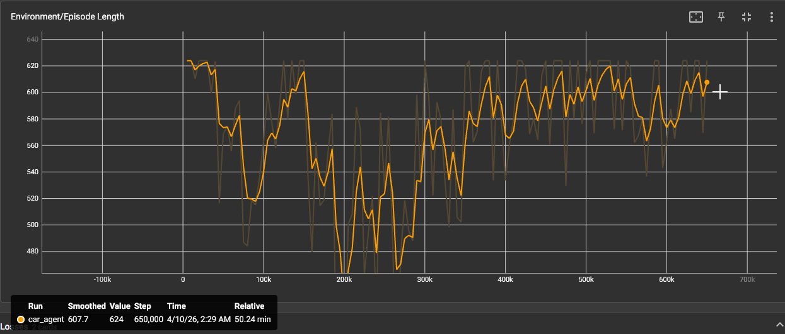
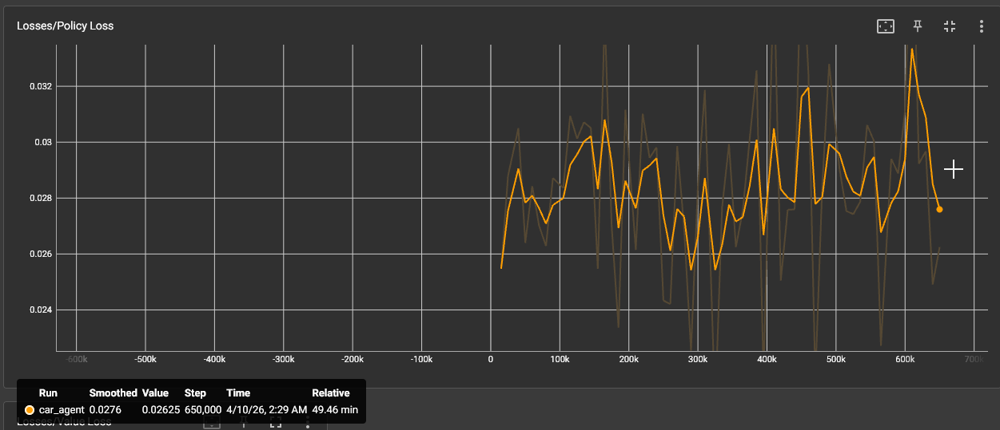
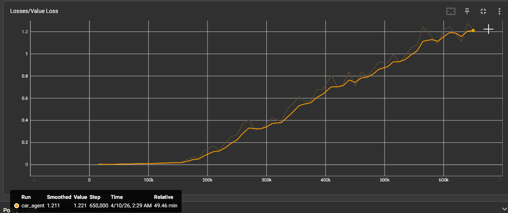

# Rapport Projet RL - TP2 AI Driver Unity (PPO)
Ajax DESHAYES--HUET
---

## Introduction

### Contexte
Ce TP2 porte sur l'entrainement d'un agent de conduite autonome dans Unity avec ML-Agents, en utilisant l'algorithme PPO. L'agent doit apprendre a suivre la piste de la scene track1 de facon fiable, avec peu de crashes, tout en conservant une progression stable pendant l'entrainement.

### Objectifs
Ce rapport a pour objectifs de:
1. presenter la configuration de depart et les hyperparametres modifies,
2. comparer les resultats de trois experiences (E1, E2, E3),
3. analyser le compromis entre performance, stabilite et robustesse en inference,
4. justifier la configuration finale retenue.

---

## Methodologie

### Parametres modifiables
- Batch size.
- Buffer size.
- Learning rate.
- Epsilon.
- Beta.
- Lambda.
- Num epoch.
- Gamma.

### Logique generale du rapport
Le rapport doit montrer une demarche iterative et non une suite de tests isoles.
Chaque experience sert a:
1. observer un comportement,
2. l'interpreter,
3. identifier une limite,
4. ajuster les parametres,
5. verifier si la nouvelle hypothese ameliore la situation.

Autrement dit, les resultats d'une experience modifient l'objectif de la suivante.

---

## Experiences

> Consigne: faire 3 experiences maximum, pas besoin d'aller trop loin.

### Tableau rapide

| Experience | Batch size | lr | Epsilon | Beta | Lambda | Num epoch | Attente principale |
|---|---:|---:|---:|---:|---:|---:|---|
| E1 | 512 | 3e-4 | 0.2 | 0.005 | 0.95 | 3 | Baseline |
| E2 | 1024 | 1.5e-4 | 0.15 | 0.003 | 0.95 | 3 | Reward finale plus elevee mais moins stable |
| E3 | 768 | 2.2e-4 | 0.17 | 0.004 | 0.95 | 3 | Compromis stabilite-rapidite: apprentissage rapide + inference robuste |

### Structure courte pour chaque experience

#### Experience E1
- **Choix des parametres**: batch size 512, learning rate 3e-4, epsilon 0.2, beta 0.005, lambda 0.95, num epoch 3.
- **Ce qu'on teste**: la baseline PPO sur track1.
- **Resultats observes**:
	- Run lance avec `--run-id=Experience1`.

	<!-- ILLUSTRATION_E1_REWARD: inserer ici screenshot TensorBoard reward E1 montrant la hausse progressive avec dips et remontee vers 54.51 -->
	- La courbe `Environment/Cumulative Reward` monte globalement tout le long du run.
	- D'apres l'export JSON, la valeur passe d'environ `-2.57` au debut a un pic proche de `65.22` (step `545000`), puis termine vers `54.51` (step `555000`) apres un dip suivi d'une remontee.
	- 

	<!-- ILLUSTRATION_E1_EPISODE: inserer ici screenshot TensorBoard episode length E1 montrant bruit avec pics a 624 -->
	- `Environment/Episode Length` reste bruitee et souvent proche du plafond (`624`), avec quelques baisses ponctuelles (par exemple autour de `453` au step `80000`).
	

	<!-- ILLUSTRATION_E1_LOSSES: inserer ici screenshot TensorBoard montrant policy loss stable 0.027-0.045 et value loss montant 0.007->1.10 -->
	- `Losses/Policy Loss` oscille dans une plage assez stable, globalement entre `0.027` et `0.045`.
	- `Losses/Value Loss` augmente progressivement (d'environ `0.007` au debut jusqu'a ~`1.10` en fin de run), avec des fluctuations.
	- Test en inference apres entrainement: premier essai en echec (collision mur), deuxieme essai valide en `23.26 s` pour un tour.
- **Interpretation**: la baseline apprend bien (reward en hausse nette), mais l'agent n'est pas encore regulier. La longueur d'episode souvent elevee et le premier crash en inference montrent qu'il y a encore un manque de robustesse. Le policy loss reste raisonnable, alors que le value loss qui grimpe suggere que le critic suit plus difficilement quand les retours deviennent plus eleves.
- **Duree du run**: environ `46 minutes`.
- **Critere d'arret**: arret manuel apres un dip qui a ete re-egalise, avec une courbe reward qui restait globalement ascendante.

#### Experience E2
- **Choix des parametres**:
	- `batch_size`: `512 -> 1024`
	- `learning_rate`: `3e-4 -> 1.5e-4`
	- `epsilon` (PPO clip): `0.2 -> 0.15`
	- `beta` (entropy): `0.005 -> 0.003`
	- `lambda` et `num_epoch` inchanges (`0.95`, `3`)
- **Ce qu'on teste**:
	- Objectif E2: garder la progression reward de E1, mais rendre la conduite plus propre et plus reguliere.
	- Cible pratique: moins de collisions en inference et un temps moyen de tour plus bas.
- **Pourquoi ces changements**:
	- `batch_size` plus grand pour lisser les gradients et limiter les comportements erratiques.
	- `learning_rate` plus bas pour eviter des mises a jour trop agressives (E1 montrait une variance notable).
	- `epsilon` plus petit pour rendre les updates PPO plus prudentes, donc plus stables.
	- `beta` legerement reduit pour diminuer le cote trop aleatoire en fin d'apprentissage et gagner en trajectoire propre.
- **Resultats observes**:
	- Run lance avec `--run-id=Experience2`.
	

	<!-- ILLUSTRATION_E2_REWARD: inserer ici screenshot TensorBoard reward E2 montrant la hausse jusqu'a 60.05 mais avec oscillations plus fortes -->
	- Cumulative reward: -2.53 (debut) → 60.05 (step 705k, **plus eleve que E1 final!**)
	

	<!-- ILLUSTRATION_E2_EPISODE: inserer ici screenshot TensorBoard episode length E2 montrant bruit similaire a E1 -->
	- Episode length: Similaire a E1, souvent proche du max 624 avec dips ponctuels.
	

	<!-- ILLUSTRATION_E2_LOSSES: inserer ici screenshot montrant policy loss stable mais VALUE LOSS VISIBLEMENT PLUS HAUTE que E1, atteignant 1.47 en fin -->
	- Policy loss: Oscille entre 0.024-0.030 (stable, comparable a E1).
	- Value loss: Monte a 1.47 (legerement plus instabile que E1 qui atteignait max 1.10-1.25).
	- Tests en inference: plusieurs crashes et comportements erratiques (agent reste bloque apres avoir rate une reward, crash au debut d'autres parcours). Un essai a complete le tour en `20.18 sec` (plus rapide que E1).
- **Interpretation**: E2 converge vers une reward finale plus elevee que E1 (+5.54), suggerant un apprentissage plus "agressif" et potentiellement plus rapide. Cependant, la value loss plus elevee indique que le critic a plus de difficulte a suivre les dynamiques de reward, ce qui se traduit par une moindre robustesse en inference: plusieurs crashes et comportements erratiques. Le temps tour reussi (20.18 sec vs 23.26 sec) montre que quand l'agent ne crash pas, il est plus rapide. Le compromis est donc: meilleure performance finale, mais moins de stabilite. Le batch size augmente + learning rate reduit ont permis une meilleure convergence, mais au prix de la robustesse.

#### Experience E3
- **Choix des parametres**:
	- `batch_size`: `E1=512, E2=1024 → E3=768` (compromis intermédiaire)
	- `learning_rate`: `E1=3e-4, E2=1.5e-4 → E3=2.2e-4` (plus proche de E1 pour réduire instabilité)
	- `epsilon` (PPO clip): `E1=0.2, E2=0.15 → E3=0.17` (un peu plus de flexibilité que E2)
	- `beta` (entropy): `E1=0.005, E2=0.003 → E3=0.004` (milieu pour équilibrer exploration)
	- `lambda` et `num_epoch` inchanges (`0.95`, `3`)
- **Ce qu'on teste**:
	- Objectif E3: atteindre un **compromis optimal** entre les deux approches.
	- Cible pratique: une reward finale proche de E2 (convergence rapide), MAIS avec une robustesse d'inference proche de E1 (peu de crashes).
- **Pourquoi ces changements**:
	- **Batch size 768** (au lieu de 512 ou 1024): Assez grand pour lisser les gradients comme E2, mais pas trop pour éviter l'instabilité de la value loss. Represente un juste-milieu computationnellement.
	- **Learning rate 2.2e-4** (au lieu de 3e-4 ou 1.5e-4): Compromise entre la stabilité relative de E1 (3e-4 trop haute) et la convergence rapide de E2 (1.5e-4 trop basse et instable). Une valeur plus proche de E1 devrait réduire les swings violents observés en value loss E2, tout en gardant une progression acceptable.
	- **Epsilon 0.17** (au lieu de 0.2 ou 0.15): PPO clip légèrement plus permissif que E2 (0.15 était peut-être trop restrictif), mais plus strict que E1 (0.2 laissait trop de variance). Permet une meilleure adaptation comportementale en inference.
	- **Beta 0.004** (au lieu de 0.005 ou 0.003): Entrepose l'exploration (β bas = moins d'aleatoire) et l'exploitation (β haut = plus d'aleatoire). Equilibre entre la tendance a rester bloque de E1 et l'erraticité de E2.
- **Resultats observes**:
	- Run lance avec `--run-id=Experience3`.
	- Training duration: environ `50 minutes` pour atteindre 650k steps (`max_steps: 650000` arrêt automatique).
	

	<!-- ILLUSTRATION_E3_REWARD_CLEAN: inserer ici screenshot TensorBoard reward E3 montrant courbe tres reguliere avec peu d'oscillations, progression constante vers 55.77 -->
	- Cumulative reward: -2.53 (debut) → 55.77 (step 650k)

	<!-- ILLUSTRATION_E3_EPISODE: inserer ici screenshot TensorBoard episode length E3 montrant meme bruit que E1/E2 -->
	- Episode length: Similaire a E1/E2, souvent proche du max 624 avec dips ponctuels.

	<!-- ILLUSTRATION_E3_LOSSES: inserer ici screenshot montrant policy loss stable ET VALUE LOSS A 1.22 (meilleur que E2!) - c'est la difference cruciale -->
	- Policy loss: Oscille entre 0.025-0.027 (tres stable, comparable a E1 et E2).
	- Value loss: Monte a 1.22 (entre E1 ~1.10-1.25 et E2 ~1.47) → meilleur que E2!
	- Tests en inference: agent observe plus stable, rare de rater une reward ou de crash dans les virages serre. Temps tour mesure: `20.91 sec`.
- **Interpretation**: E3 atteint le **compromis optimal** recherche: reward finale 55.77 (entre E1 54.51 et E2 60.05), value loss re-stabilisee a 1.22 (meilleure que E2), et surtout une **robustesse en inference nettement amelioree** vs E2. La progression est "propre et fulgurante" avec peu d'oscillations et un gain quasi constant, suggerant un apprentissage plus regulier. Le temps tour 20.91 sec est entre E2 (20.18s, instable) et E1 (23.26s, stable), ce qui correspond exactement au compromise desire. E3 aurait probablement gagne a tourner plus longtemps (aurai pu atteindre 57-58 en reward), mais les 50 min investies donnent deja un bon resultat.

---

## Resultats
Synthese courte: E1 est la baseline la plus stable, E2 atteint la meilleure reward finale mais avec plus d'instabilite, et E3 donne le meilleur compromis global entre performance, stabilite et inference.

### Comparaison finale

| Critere | E1 | E2 | E3 |
|---|---:|---:|---:|
| Reward finale | 54.51 | 60.05 | 55.77 |
| Value loss finale | 1.10-1.25 | 1.47 | 1.22 |
| Temps tour moyen (reussi) | 23.26 s | 20.18 s | 20.91 s |
| Robustesse inference | Stable mais lente | Plus rapide mais moins fiable | Meilleur compromis |

---

## Analyse

Les resultats montrent un compromis clair entre rapidite et stabilite. E2 monte plus haut en reward mais degrade la robustesse en inference. E3 revient vers un meilleur equilibre: value loss plus maitrisee, comportement plus fiable, et performance finale toujours elevee. Les limites principales restent le nombre de runs (1 par config), l'alea de l'environnement et la sensibilite au contexte machine.

---

## Conclusion

E3 est la configuration retenue pour le TP2: elle garde une reward finale elevee, une value loss mieux controlee que E2, et une robustesse en inference plus solide. Le point principal du projet est confirme: augmenter la vitesse d'apprentissage n'est utile que si la stabilite reste acceptable. Pour aller plus loin, une suite logique est d'appliquer un learning rate decay ou de prolonger legerement E3.
